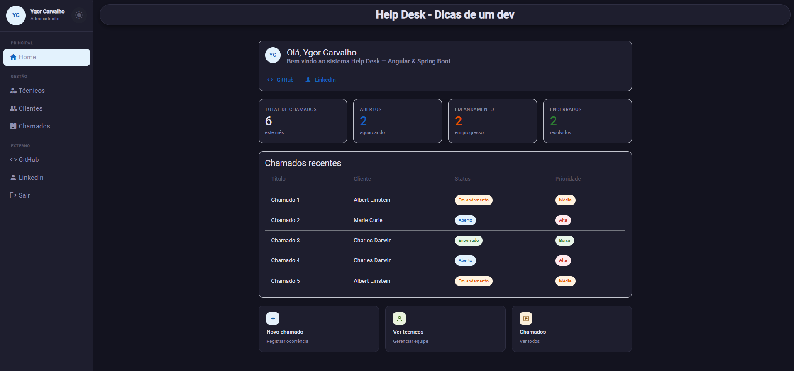
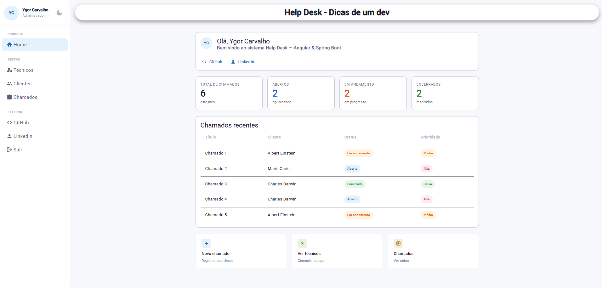
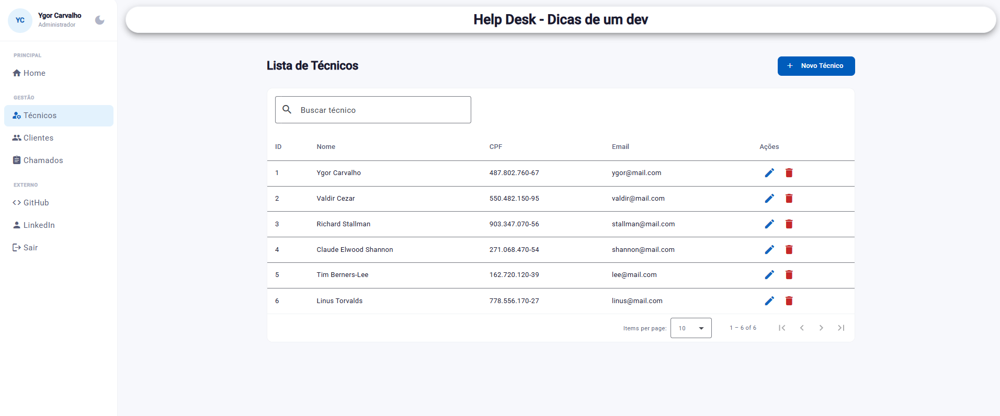
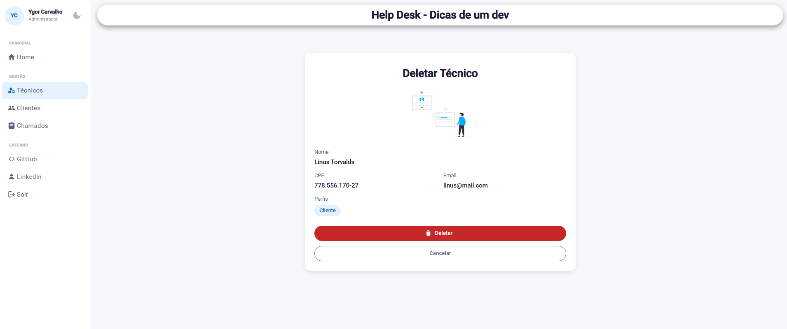
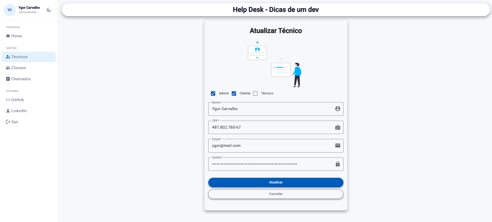
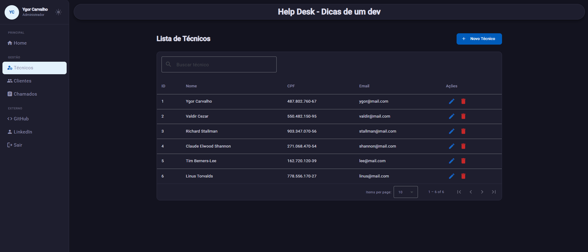
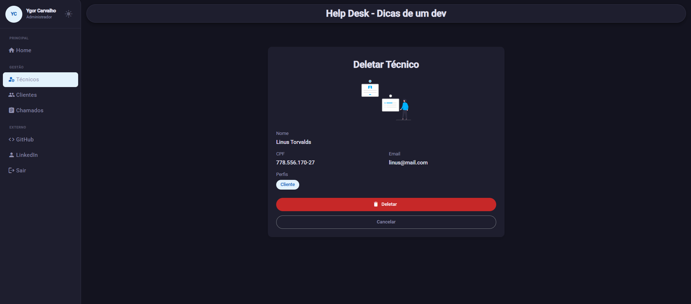
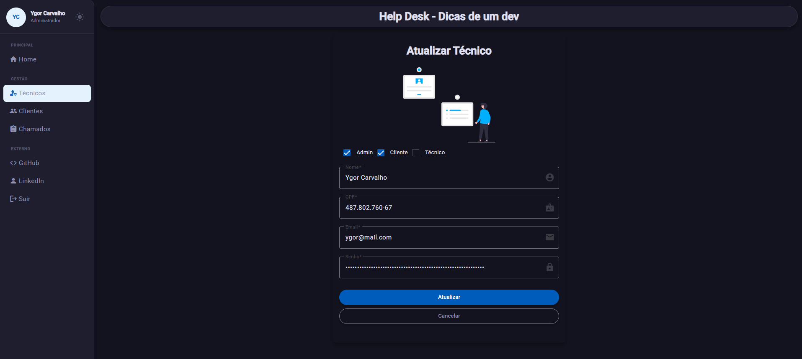

# Help Desk — Frontend

## 🚀 Preview




---

## 📌 Sobre o projeto

Aplicação web para gerenciamento de chamados técnicos, desenvolvida com Angular e Angular Material.

Projeto inspirado em curso, com diversas melhorias e evoluções implementadas de forma independente, incluindo redesign completo da interface, tema escuro, responsividade e padronização visual.

---

## 🛠️ Tecnologias

* Angular 17+
* Angular Material (MDC)
* TypeScript
* RxJS
* ngx-mask
* ngx-toastr
* Spring Boot (backend separado)

---

## ⚙️ Funcionalidades

* Autenticação com JWT
* CRUD de técnicos
* CRUD de clientes
* Abertura e acompanhamento de chamados
* Filtro e paginação nas listagens
* Layout responsivo
* Tema escuro com persistência via localStorage

---

## 🧠 Diferenciais técnicos

* Implementação de tema dinâmico com CSS Variables
* Controle de responsividade com BreakpointObserver (Angular CDK)
* Interceptor HTTP para autenticação com JWT
* Customização avançada do Angular Material (MDC)
* Padronização de layout e design system

---

## 🎨 Melhorias implementadas

* Dark mode completo com troca dinâmica de tema
* Sidenav redesenhado com seções, avatar e navegação organizada
* Badges visuais para status e prioridade
* Telas de confirmação (delete) com UI moderna
* Melhorias de UX e consistência visual
* Layout adaptado para mobile (menu hamburguer)

---

## 📸 Screenshots

### 🌞 Light mode

| Home                         | Lista                                | Delete                           | Update                           |
| ---------------------------- | ------------------------------------ | -------------------------------- | -------------------------------- |
|  |  |  |  |

---

### 🌙 Dark mode

| Home                        | Lista                               | Delete                          | Update                           |
| --------------------------- | ----------------------------------- | ------------------------------- | -------------------------------- |
|  |  |  |  |

---

## ▶️ Como rodar

### Pré-requisitos

* Node.js 18+
* Angular CLI

### Instalação

```bash
git clone https://github.com/ygor-ccarvalho/helpdesk_frontend
cd helpdesk_frontend
npm install
ng serve
```

Acesse: http://localhost:4200

> ⚠️ O backend precisa estar rodando
> https://github.com/ygor-ccarvalho/helpdesk_backend

---

### 🚧 Próximos passos

* Implementar recuperação de senha (fluxo completo com envio de e-mail e redefinição)
* Melhorar responsividade
* Implementar testes unitários

---

## 👨‍💻 Autor

**Ygor Carvalho**

* 🔗 LinkedIn: https://www.linkedin.com/in/ygorcarvalhodev/
* 💻 GitHub: https://github.com/ygor-ccarvalho
